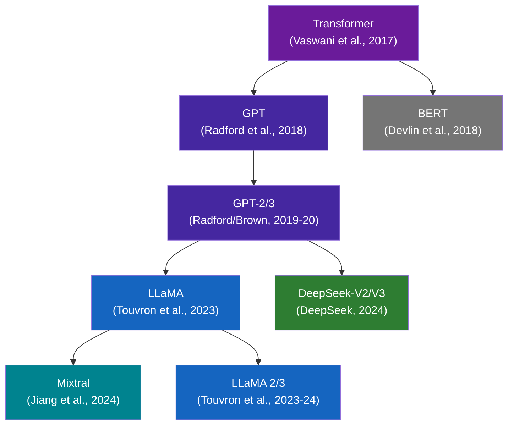
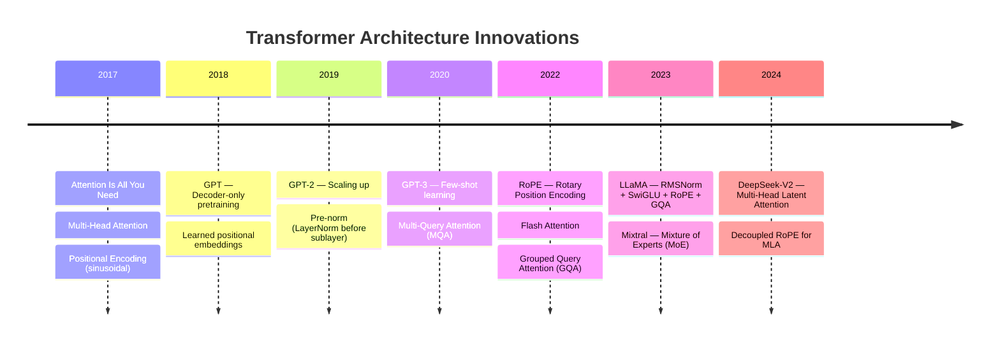
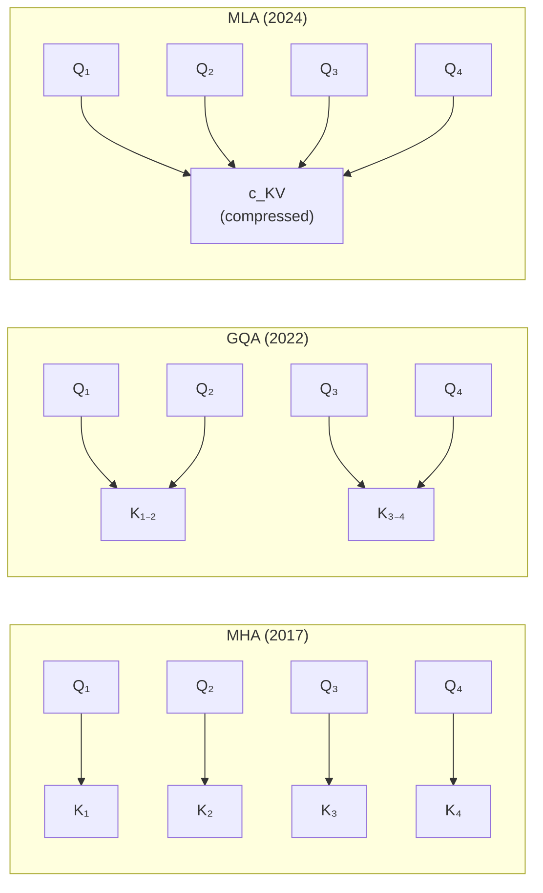
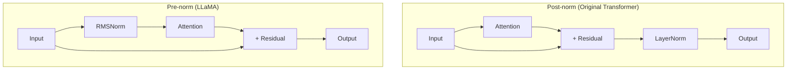
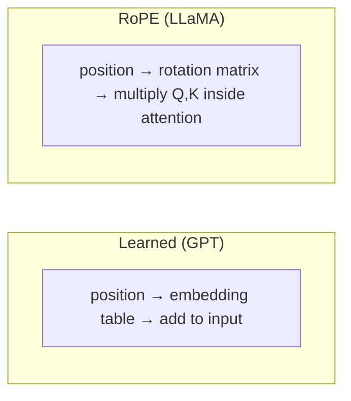

# The Transformer Family Tree

How did we get from "Attention Is All You Need" to modern LLMs like LLaMA and
DeepSeek? This page traces the evolution of transformer architectures,
highlighting the key innovations at each step.

## Evolution Overview

!!! note "Decoder-only focus"
    LMT focuses on **decoder-only** (autoregressive) transformers used for
    language modeling. BERT and encoder-decoder models are shown for context
    but are not implemented in the library.

## Key Innovations Timeline

## What Changed and Why

### 1. Attention: MHA → GQA → MLA

The biggest bottleneck in transformer inference is the **KV cache** — storing
key and value tensors for all previous tokens. Each innovation reduces this
cost:

| Mechanism | KV Heads | Cache per Token | Quality |
|-----------|----------|-----------------|---------|
| **MHA** | `num_heads` | `2 * num_heads * head_dim` | Baseline |
| **MQA** | 1 | `2 * head_dim` | Slight degradation |
| **GQA** | `num_kv_heads` | `2 * num_kv_heads * head_dim` | Near-MHA |
| **MLA** | Compressed | `compress_dim + rope_dim` | Near-MHA |

??? info "How MLA compression works"
    MLA compresses the full KV representation into a small latent vector:

    1. **Compress**: `c_KV = x @ W_DKV` (project to low-rank space)
    2. **Cache**: Store only `c_KV` (much smaller than full K, V)
    3. **Decompress**: `K = c_KV @ W_UK`, `V = c_KV @ W_UV`

    The key insight: K and V information is highly redundant across heads,
    so a shared low-rank factorization captures most of the signal.

### 2. Normalization: Post-norm → Pre-norm, LayerNorm → RMSNorm

**Why pre-norm?** In post-norm, gradients must flow through the normalization
layer on the residual path. Pre-norm leaves the residual stream "clean" —
gradients flow directly through addition, making deep networks easier to train.

**Why RMSNorm over LayerNorm?** RMSNorm drops mean-centering (only normalizes
by root-mean-square). This is ~15% faster with no quality loss — the learned
scale parameter can compensate for any mean shift.

### 3. Activation: GELU → SwiGLU

Standard FFN: `FFN(x) = W₂ · GELU(W₁ · x)`

SwiGLU FFN: `SwiGLU(x) = W₂ · (SiLU(W_g · x) ⊙ W₁ · x)`

The **gating mechanism** `SiLU(W_g · x)` learns *which features to pass
through* rather than applying a fixed nonlinearity. This is more expressive —
the gate can selectively amplify or suppress different feature dimensions.

!!! tip "Parameter count trick"
    SwiGLU uses 3 weight matrices instead of 2, but compensates by using
    `hidden_dim = ⅔ × 4d` instead of `4d`, keeping total parameters similar.

### 4. Position Encoding: Learned → RoPE

**Key advantage of RoPE**: The dot product `q · k` depends only on the
*relative* position `m - n`, not absolute positions. This means the model
generalizes better to sequences longer than those seen during training.

RoPE applies rotations in 2D subspaces of each attention head:

$$
\text{RoPE}(x, m) = \begin{pmatrix} x_1 \cos m\theta - x_2 \sin m\theta \\ x_2 \cos m\theta + x_1 \sin m\theta \end{pmatrix}
$$

where $m$ is the position and $\theta_i = \text{base}^{-2i/d}$ controls the
frequency for each dimension pair.

## Models in LMT

Here's how each model in the library maps to these innovations:

| Model | Norm | Attention | FFN | Position | Init |
|-------|------|-----------|-----|----------|------|
| [GPT](../models/gpt.md) | Post-norm LayerNorm | MHA | GELU FFN | Learned | Standard |
| [LLaMA](../models/llama.md) | Pre-norm RMSNorm | GQA | SwiGLU | RoPE | Scaled residual |
| [Mixtral](../models/mixtral.md) | Pre-norm RMSNorm | GQA + SWA | MoE (SwiGLU) | RoPE | Scaled residual |

All models can be built using the [`ConfigurableBlock`](../api/layers.md)
system, which lets you mix and match these components via string keys.

## Further Reading

- [Attention Is All You Need](https://arxiv.org/abs/1706.03762) — The original transformer
- [LLaMA: Open and Efficient Foundation Language Models](https://arxiv.org/abs/2302.13971)
- [Mixtral of Experts](https://arxiv.org/abs/2401.04088)
- [DeepSeek-V2: A Strong, Economical, and Efficient Mixture-of-Experts Language Model](https://arxiv.org/abs/2405.04434)
- [RoFormer: Enhanced Transformer with Rotary Position Embedding](https://arxiv.org/abs/2104.09864)
- [GLU Variants Improve Transformer](https://arxiv.org/abs/2002.05202) — SwiGLU
